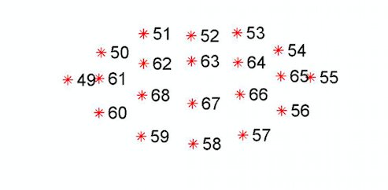

# SmileDetection
The script turns on the web cam, detects the human face and automatically takes a picture when the person is smiling and his/her both eyes are open. 

Dlib is not compatible with python 3.7
 none of the .whl file were compatible with 3.7
 
 
 
 
 
Step #1: Localize the face in the image.

Step #2: Detect the key facial structures on the face ROI.
	Mouth
	Right eyebrow
	Left eyebrow
	Right eye
	Left eye
	Nose
	Jaw

The facial landmark detector included in the dlib library  which uses pretrained regression trees

 

From the image, can be seen that facial regions can be accessed via simple Python indexing (the image above is one-indexed):

- The mouth can be accessed through points [48, 68].
- The right eye can be accessed through points [36, 42].
- The left eye can be accessed through points [42, 48].

____
For smile detection I considered only the following 20 coordinates from facial landmarks.

 

For detecting whether person is smiling or not for every frame Mouth Aspect Ration(MAT) is calculated, where

For checking the eyes are open or not I used Eye Aspect Ratio(EAR) from the [Real-Time Eye Blink Detection using Facial Landmarks](http://vision.fe.uni-lj.si/cvww2016/proceedings/papers/05.pdf) paper

 

 

