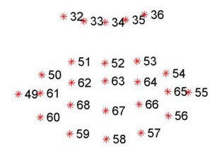

# Smile Detection
The `smile_detection.py` script turns on the web cam, detects the human face and automatically takes a picture when the person is smiling and his/her both eyes are open. 

For understanding whether the person is smiling or not firstly is needed to localize face and find mouth on it.

`Haar cascades` is used as a facial landmark detector. The pretrained model is included in the `dlib` library  
This model returns 68 coordinates of the face essential points, visualized in the following figure

 

From the image, can be seen that facial regions can be accessed via simple Python indexing (the image above is one-indexed):

- The mouth can be accessed through points [48, 68].
- The right eye can be accessed through points [36, 42].
- The left eye can be accessed through points [42, 48].

____
### Detecting smile

For smile detection I considered only the following 20 coordinates from facial landmarks.

 

If the person is smiling the distance between 49 and 55 points increases, but that distance also will increase if person comes closer to the webcam.
besides the fact that the distance is increasing, the mentioned points move little bit up approaching to the nose.
Consequentely for detecting whether person is smiling or not I used the following key indicator. 

Let's suppose 
- `a1` is the midpoint of 49th and 55th landmark points  
- `a2` is the midpoint of 6 mouth landmarks of the center of the mouth (62, 63, 64, 66, 67, 68)  
- `n` is one of the points on the nose, particularly, I set n equal to the 34th point   
	
	

 

if the ditance between `a1` and `n` is greater than the distance between `a2` and `n`, person is smiling. \
in the `detect_smile()` function threshold is added for higher accuracy.

____
### Checking eyes

For checking the eyes are open or not I used Eye Aspect Ratio(EAR) from the ["Real-Time Eye Blink Detection using Facial Landmarks"](http://vision.fe.uni-lj.si/cvww2016/proceedings/papers/05.pdf) paper

 

 

If the eye is open EAT is relatively constant over time and is larger than when eye is closed, in this case EAT is more closer to zero.

If EAT of the detected eye is lower than the given threshold, the eye is closed or partly open. \
By default threshold is set to 0.2.

____

The script loops over the frames of the videostream and for every frame checkes for smile and opened eyes. \
If requirements are satisfied for 15 frames in sequence, the selfie will be automatically captured, saved and windows closed. 

The videostream also stops if `q` key is pressed.

